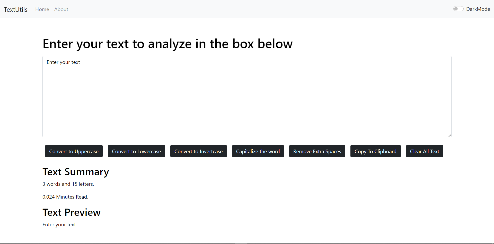
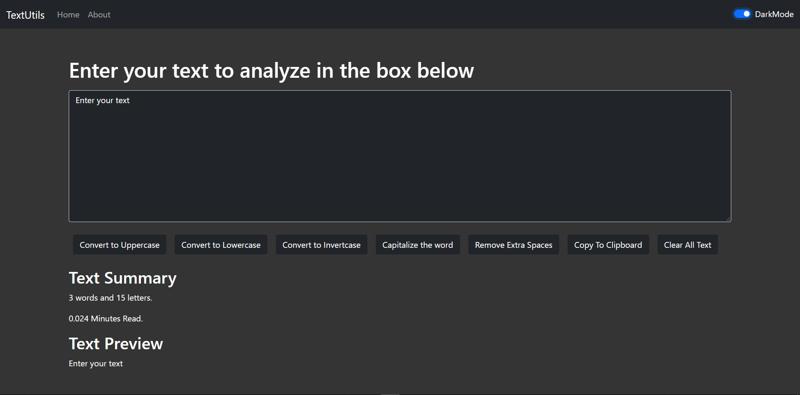
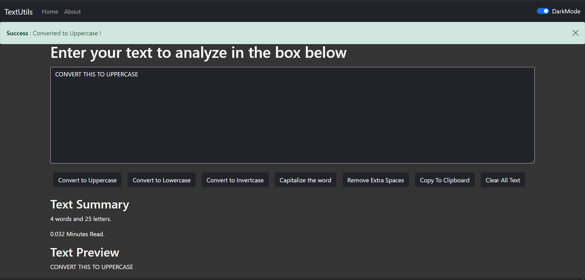

# Text-Utils

This project was bootstraped with [create react app](https://github.com/facebook/create-react-app)

TextUtils is a tool that allows you to analyse a text quickly and effeciently by counting the number of words and characters present. It also helps in manupulating the text by providing various useful utilities like different kind of conversions, copying and clearing text, etc. 

Be it word count, character count, or manupulating the text, you can do it all at one place.

# Functioning 
1. The app contains both light and dark mode.

2. When we convert our text using the utilities provided, it also throws an alert of success.

